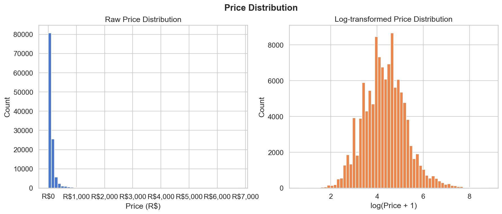
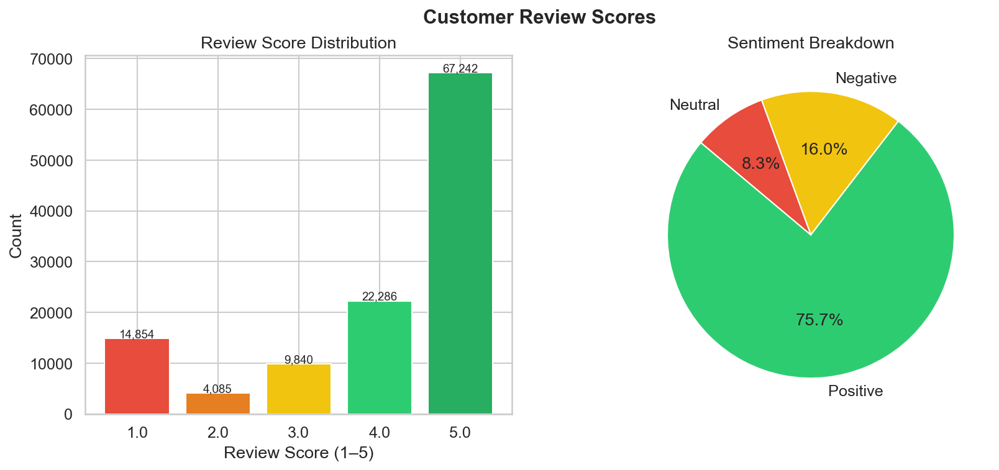
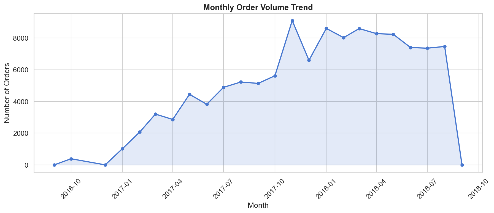
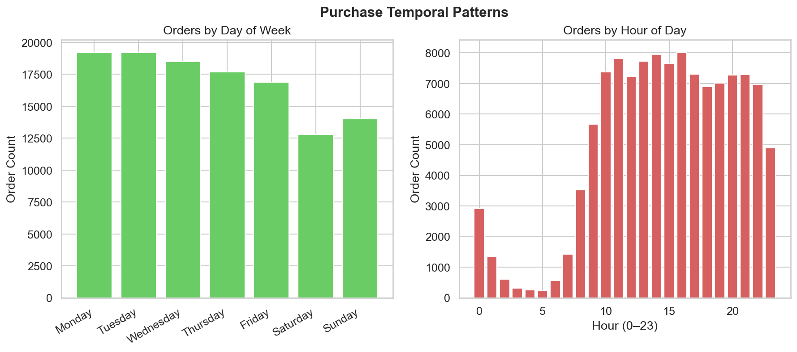
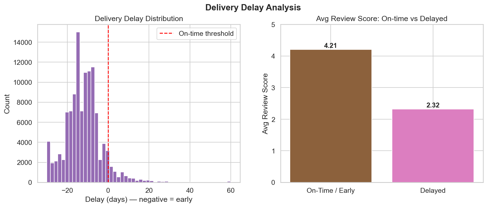
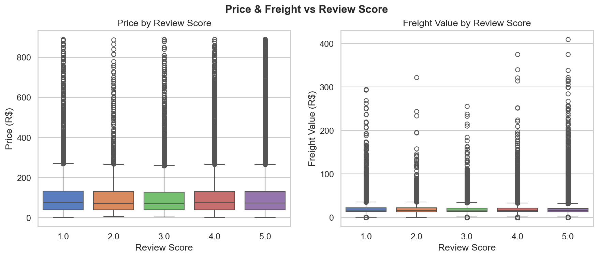
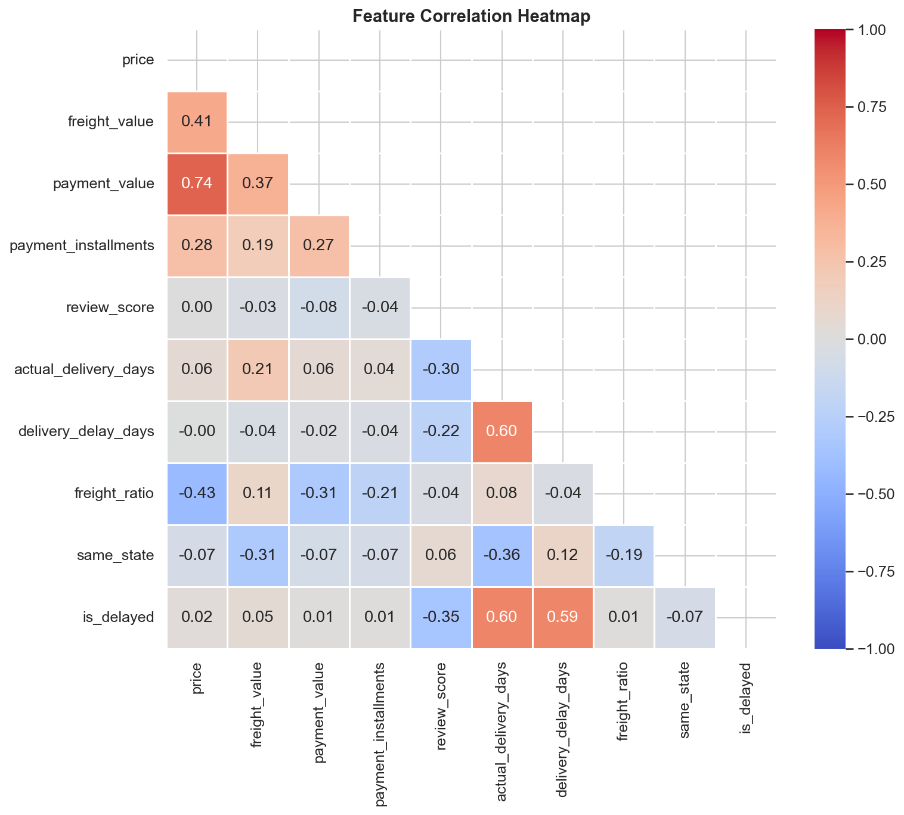
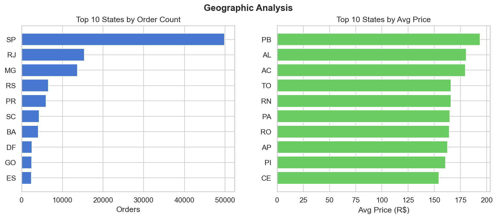
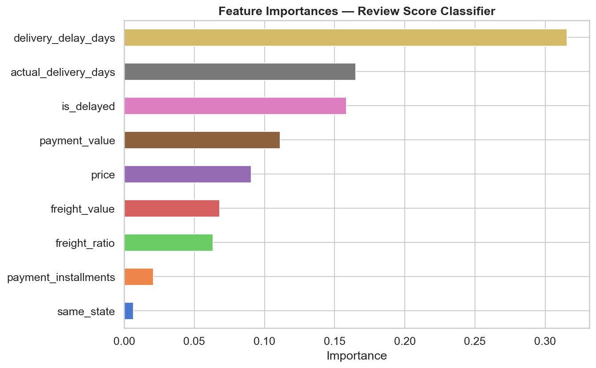

# E-Commerce Price Analysis

A end-to-end data science project built on 119,000+ Brazilian e-commerce orders.
The goal was to understand what drives pricing, freight costs, payment behavior,
and — most importantly — why customers leave low review scores.

---

## What This Project Covers

- Data cleaning and feature engineering on real-world messy data
- Exploratory analysis with 10 charts covering price, delivery, payments, and geography
- Three machine learning tasks: price prediction, review classification, customer segmentation
- An interactive Streamlit dashboard with live filters and a review score predictor

---

## Key Findings

- Average order price is **R$120.65**, but the median sits at R$74.90 — most orders are budget purchases
- **Credit card** is used in 73.7% of orders, with an average of 2.9 installments
- Average review score is **4.02 / 5**, with 75.7% positive and 16% negative
- Delayed orders score **2.32 stars** on average versus **4.16** for on-time deliveries —
  delivery delay is by far the strongest predictor of a bad review

---

## Output Charts

| Price Distribution | Review Scores |
|---|---|
|  |  |

| Orders Over Time | Temporal Patterns |
|---|---|
|  |  |

| Delivery Delay Analysis | Price vs Review Score |
|---|---|
|  |  |

| Correlation Heatmap | Geographic Analysis |
|---|---|
|  |  |

| Feature Importances | Cluster Profiles |
|---|---|
|  |  |

---

## Project Structure

```
Ecommerce-Price-Analysis/
├── data/
│   └── Ecommerce_price_Analysis.csv
├── scripts/
│   ├── 01_data_loading.py
│   ├── 02_data_cleaning.py
│   ├── 03_eda.py
│   ├── 04_modeling.py
│   ├── 05_evaluation.py
│   └── 06_dashboard.py
├── outputs/          # all charts saved here
├── models/           # saved model files
├── requirements.txt
└── README.md
```

---

## Setup and Usage

**1. Clone the repository and create a virtual environment**
```bash
git clone https://github.com/Shubham03-hub/E-Commerce-Price-Analysis-project.git
cd E-Commerce-Price-Analysis-project

python -m venv venv
venv\Scripts\activate        # Windows
source venv/bin/activate     # Mac/Linux
```

**2. Install dependencies**
```bash
pip install -r requirements.txt
```

**3. Run the pipeline in order**
```bash
python scripts/01_data_loading.py
python scripts/02_data_cleaning.py
python scripts/03_eda.py
python scripts/04_modeling.py
python scripts/05_evaluation.py
```

**4. Launch the dashboard**
```bash
streamlit run scripts/06_dashboard.py
```
Opens at `http://localhost:8501`

---

## Author

**Shubham Panchal**
Data Science, Data Analytics and Machine Learning — focused on practical, end-to-end projects.
[linkedin.com/in/shubham-panchal-a100282a8](https://linkedin.com/in/shubham-panchal-a100282a8)
```
